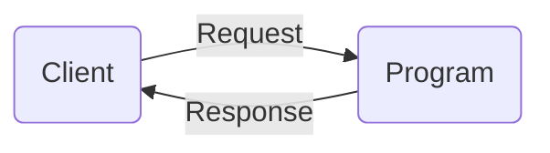
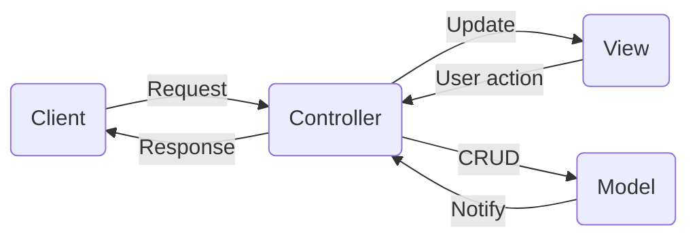

## 「PHPプログラミング勉強会」（応用編）

### １．MVCに基づくWebシステム開発

Webアプリケーションは、クライアントからの**リクエスト**に対して、様々な**処理**を経て結果を**表示**することが基本となる。これらをすべてひとつのプログラムに集約すると、**プログラムが肥大化しやすく、開発効率が悪化したり、保守コストが高くなったりする**要因になる。



**MVC**とは、**データ処理**（`Model`）と**画面表示** （`View`）を分割し、さらに全体の流れを**制御する役割**（`Controller`）を担う部分を役割別に分担するプログラムを組む仕組みである。特に、チーム開発では、メンバー間で、フロントエンド、バックエンドの開発作業を分担し、大規模で複雑なシステムで効率よく開発できる。



※`CRUD`とは、`Create`（登録）, `Retrieve`（検索）, `Update`（更新）, `Delete`（削除）といったデータに対する基本操作の略称

**MVC**を理解するために、リクエスト解析、名前空間、オブジェクト指向プログラミング等の基礎知識が必要であるが、今回は、MVC入門として、MVCに基づくプログラムを一から作る演習を通して、MVCのアイデアを理解してもらうことが目的である。さらに、もう少し本格なプログラムを組みたい方に向けて、別のサンプルも提供する。

### ２．サンプルプログラム

#### 2.1 フォルダ・ファイルのレイアウト

```sh
├── spl2025min
│   ├── src # ソースコードのフォルダ
│        ├──controllers
│            └──Controller.php
│        ├──models
│            └──Model.php
│        └──views
│            ├──templates
│                 ├──pg_footer.php
│                 ├──pg_header.php
│                 └──usr_list.php
│            └───View.php
│   ├──.htaccess
│   ├──index.php
│   └──REDME.md # READMEファイル
```

#### 2.2 各ファイルのソースコード

**a. リクエスト転送に関する設定ファイル**

**ファイル名：** `.htaccess`

```htaccess
RewriteEngine On
RewriteCond %{REQUEST_FILENAME} !-d
RewriteCond %{REQUEST_FILENAME} !-f
RewriteRule ^(.+)$ index.php [QSA,L] 
```

**b. コントローラー（`Controller`）に関するクラス**

**ファイル名：** `src/controllers/Controller.php`

```php
<?php
/**
 * Controller: base class of controllers, instantiation forbidden
 */
abstract class Controller
{
    protected $model;
    protected $view;
    public function __construct($model, $view)
    {
        $this->model = $model;
        $this->view = $view;
    }
    public function model()
    {
        return $this->model;
    }
    public function view()
    {
        return $this->view;
    }    
}

/**
 * UserController: controller class for user accounts 
 */
class UserController extends Controller
{
    public function listAction()
    {
        $list = $this->model()->getList();
        return $this->view()->render('usr_list', ['users'=>$list]);
    }
}
```

**c. モデル（`Model`）に関するクラス**

**ファイル名：** `src/models/Model.php`

```php
<?php
/**
 * Model: base class of models, instantiation forbidden
 */    
abstract class Model
{
    static protected $table;
}

/**
 * UserModel: model class for user accounts 
 */
class UserModel extends Model
{
    static protected $table = 'tb_user';

    public function getList(){
        return [
            ['name'=>'abe', 'sex'=>'femle', 'age'=>20],
            ['name'=>'tom', 'sex'=>'male', 'age'=>18],
        ];
    }
}
```


**d. ビュー（`View`）に関するクラス**

**ファイル名：** `src/views/View.php`


```php
<?php
/**
 * View: base class of views 
 */     
class View
{
    static protected $template_dir = 'src/views/templates/';
    
    protected $url_base;
    
    protected $shared = []; # 複数画面に共通する変数
    
    public function __construct($base=null)
    {
        $this->url_base = $base;
    }

    function share($name, $value)
    {
        $this->shared[$name] = $value;
    }
    
    function render($template, $params)
    {
        ob_start();
        extract($this->shared); # 複数画面共通の変数を用意する
        extract($params); # 個別画面専用の変数を用意する
        include self::$template_dir . "pg_header.php";
        include self::$template_dir . "{$template}.php";
        include self::$template_dir . "pg_footer.php"; 
        ob_end_flush();
    }

    function redirect($url)
    {
        $real_url = $this->url_base . $url;//サイトに相対するURLから実のURLを求める
        header("Location:{$real_url}");
    }
}

/**
 * UserView: view class for user accounts 
 */
class UserView extends View
{
    
}
```

**e. ビュー（`View`）のテンプレートになるファイル**

**ファイル名：** `src/views/templates/pg_header.php`

```html
<!DOCTYPE html> 
<html>
<head>
<meta http-equiv="Content-Type" content="text/html; charset=UTF-8">
<title>Mini MVC</title>
</head>
<body>
```

**ファイル名：** `src/views/templates/pg_footer.php`

```html
</body>
</html>
```


**ファイル名：** `src/views/templates/usr_list.php`

```php

name, sex, age <br>
-------------------<br>

<?php
// 画面ごとの変数$usersを使ってユーザ一覧を出力する
foreach ($users as $user){
    echo implode(', ', $user), '<br>';
    echo '------------------<br>';
}
// グローバルな変数を表示する
echo "url_base=<u>{$_url_base_}</u>";
```

**f. システムのメインファイル（`index.php`）**
**ファイル名：** `index.php`（*テスト版：`.htaccess`設定によるリクエスト転送のテスト*）

**URL：**　`http://localhost/spl2025min/a/b?id=2`

```php
<?php
echo $_SERVER['PHP_SELF'], '<br>';
echo $_SERVER['REQUEST_URI'], '<br>';
echo $_SERVER['REQUEST_METHOD'] ;
```

`.htaccess`ファイルが存在しない場合、エラーになる:

```
 Not Found
 The requested URL was not found on this server.
```

`.htaccess`による転送設定が正しく機能する場合、以下のように出力:

```
 /spl2025min/index.php
 /spl2025min/a/b?id=2`
 GET
```


**ファイル名：** `index.php`（*簡易版：リクエストの有効性をチェックしない*）


```php
<?php
require 'src/models/Model.php';
require 'src/views/View.php';
require 'src/controllers/Controller.php';

$model = new UserModel();
$view = new UserView();
$view->share('_url_base_', 'わかりません');
$controller = new UserController($model, $view);
$action = 'listAction';
$params = [];
call_user_func_array([$controller, $action], $params); 
// $controller->$action($params); // このように書いても実行できるが、上記の書き方を推奨する

```

**ファイル名：** `index.php`（*改善版１：リクエストの有効性をチェックして不正なURLならエラーを表示する*）

```php
<?php
require 'src/models/Model.php';
require 'src/views/View.php';
require 'src/controllers/Controller.php';

$url_base = dirname($_SERVER['PHP_SELF']); # アプリのインストール先、例：/spl2025min
$request = $_SERVER['REQUEST_URI']; # リクエストのURI、例：/spl2025min/a/b/c

// ユーザ一覧機能(urlが「/u/list」か「/u/list/」のみ)を例示する
$pattern = "#^{$url_base}/u/list/?$#"; // 正しいURLのパターン（正規表現）
if (preg_match($pattern, $request, $matches)) {
    $model = new UserModel();
    $view = new UserView($url_base);
    $view->share('_url_base_', $url_base);
    $controller = new UserController($model, $view);
    $action = 'listAction';  
    $params = [];
    call_user_func_array([$controller, $action], $params);   
}else{
    echo '<div style="color:red">Bad Request!</div>';
}
```


**ファイル名：** `index.php`（*改善版２：複数のURIパターンを用意する*）

```php
<?php
require 'src/models/Model.php';
require 'src/views/View.php';
require 'src/controllers/Controller.php';

$routing_table = [
  // method, url pattern, [controller(c), action(a)], [parameters]
    ['GET', '/u/list', ['c'=>'User', 'a'=>'list']],
    ['GET', '/u/detail/(\w+)', ['c'=>'User', 'a'=>'detail'], ['uid'] ],
    ['POST', '/u/save', ['c'=>'User', 'a'=>'save']],
];

$url_base = dirname($_SERVER['PHP_SELF']); # アプリのインストール先、例：/spl2025min
$request = $_SERVER['REQUEST_URI']; # リクエストのURI、例：/spl2025min/a/b/c
$method = $_SERVER['REQUEST_METHOD'];

$mvc = null;
$params = [];
foreach ($routing_table as $rule){
    if ($method != $rule[0]) continue;
    $url = $rule[1]; 
    $pattern = "#^{$url_base}{$url}/?$#"; // 正しいURLのパターン（正規表現）
    if (preg_match($pattern, $request, $matches)){
    	$mvc = $rule[2]['c'];
    	$action = $rule[2]['a'];
        foreach ($rule[3]??[] as $i=>$p){
            $params[$p] = $matches[$i+1] ?? null;
        }
        break; // foreachから脱出する
    }
}
if (!$mvc){
	echo '<div style="color:red">Bad Request!</div>';
}else{
    $modelClass = "{$mvc}Model";
    $viewClass = "{$mvc}View";
    $ctrlClass = "{$mvc}Controller";
    $action = "{$action}Action";
    
    $model = new $modelClass();
    $view = new $viewClass($url_base);
    $view->share('_url_base_', $url_base);
    $controller = new $ctrlClass($model, $view);
      
    call_user_func_array([$controller, $action], $params);
}
```

